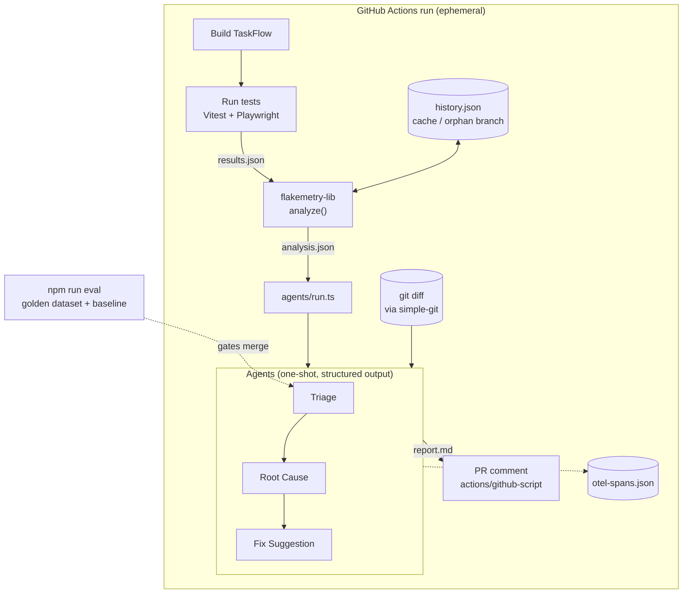

# Sentra

**An AI triage layer for CI test failures — packaged as a pipeline step, not a service.**

[](https://github.com/AKogut/ai-flaky-test-triage/actions/workflows/ci.yml)
[](https://github.com/AKogut/ai-flaky-test-triage/milestones)
[](https://github.com/AKogut/ai-flaky-test-triage/issues)
[](LICENSE)
[](package.json)

<!-- status:start -->

> **Project status: M3 — Triage agent & replay mode.**
> 3 of 11 milestones complete.
> Current exit criterion: the triage agent beats the baseline on joint accuracy by a margin that survives its confidence interval — or the finding that it does not is documented in the README. Either way, `npm run demo` runs the classifier end to end with no API key.
>
> Progress is tracked as [milestones](https://github.com/AKogut/ai-flaky-test-triage/milestones), not dates.
> Commands marked 🚧 in the script table are not implemented yet and say so when run.

<!-- status:end -->

---

## The problem

Flaky-test detectors tell you _which_ tests are unstable. They do not tell you _what to do
about it_. After every red CI run somebody still has to open the trace, read the stack, look
at the diff, and decide: is this a real bug, a badly written test, or the runner having a bad
day? That decision is repetitive, requires context from several places at once, and is exactly
the kind of work that gets skipped under deadline pressure — which is how a real regression
ends up rerun-until-green.

Sentra automates the **decision layer**, not the detection layer. It runs once, right after
the test step, reads what already exists in the CI checkout (test report, run history, git
diff), classifies every failure, hypothesises a root cause for the ones that look real, and
writes a single markdown report that gets posted as one PR comment.

## What this is

- A **single repository** that contains a small app, a test suite with genuine flakiness, and
  the AI pipeline that analyses the results.
- A **one-shot CLI pipeline**. Every part is `npm run <script>`. Nothing stays running.
- An **evaluated** system: the classifier is measured against a hand-labelled golden dataset,
  compared against a non-LLM baseline, and gated in CI.
- **Reproducible without credentials**: a recorded-response replay mode lets anyone clone the
  repo and run the whole pipeline end to end with no API key.

## What this is not

- Not a service. No server, no queue, no webhook listener, no database to host.
- Not a GitHub App. PR comments are posted by a normal workflow step using the built-in
  `GITHUB_TOKEN`.
- Not an auto-fixer. Agents never write to the working tree, never push, never open PRs.
  Fix suggestions are text in a report that a human reads and decides on.
- Not a Flakemetry replacement. Flakemetry-style analysis is consumed here as a library; this
  project is the layer above it.

---

## Architecture



Every box lives and dies inside one CI job or one terminal command. There is deliberately no
box that stays on.

Full detail: [`docs/architecture.md`](docs/architecture.md).

---

## Classification taxonomy

A single flat label list (`real_bug | flaky | stale | race_condition`) collapses under its own
weight — a race condition in application code _is_ a real bug, so the labels overlap and the
ground truth stops being reproducible. Sentra classifies on **two orthogonal axes** instead:

|                   | `deterministic`                                             | `intermittent`                                                                   |
| ----------------- | ----------------------------------------------------------- | -------------------------------------------------------------------------------- |
| **`app_code`**    | Genuine regression. Fails every run.                        | Race / ordering bug in the product. Fails sometimes. **The dangerous quadrant.** |
| **`test_code`**   | Stale test — selector or assertion drifted from the app.    | Badly synchronised test — missing wait, shared state, ordering assumption.       |
| **`environment`** | Broken setup — missing dep, bad config, wrong Node version. | Infrastructure noise — runner timeout, port collision, network blip.             |

The first axis answers _who owns the fix_. The second answers _how it will behave on rerun_.
Neither is derivable from the other, and every failure has exactly one cell.

Rationale, edge cases, and labelling rules: [`docs/taxonomy.md`](docs/taxonomy.md).

---

## Quickstart

```bash
git clone https://github.com/AKogut/ai-flaky-test-triage.git
cd ai-flaky-test-triage
npm install
```

**Run the full pipeline with no API key** — no configuration, no network, no build:

```bash
npm run demo            # writes report.md
```

It classifies the bundled run in [`demo/`](demo/) and says which classifier produced the
output. Until the first recorded evaluation lands (#38) there are no cassettes to replay, so it
runs the model-free baseline and prints that rather than implying a live classification happened.
Replay proves the plumbing — context assembly, the fences around untrusted text, the forced output
schema, the report — never the model's behaviour today; that is measured separately in
[`eval/report.md`](eval/report.md).

**Run against live models:**

```bash
export ANTHROPIC_API_KEY=sk-ant-...
npm test                # 🚧 M5 — unit + e2e, produces results.json
npm run analyze         # 🚧 M8 — flakemetry + agents, produces report.md
```

**Run TaskFlow locally:**

```bash
npm run dev             # API on :3001, client on :5173, Ctrl-C stops both
```

Ports come from `PORT` and `VITE_PORT`; a collision says so in a sentence rather than a stack
trace. The client proxies `/api` to the API, so there is no CORS layer to reason about.

**Reproduce the deliberate bug:**

```bash
SENTRA_CHAOS=37 npm run dev     # seeded latency, off unless you ask
```

TaskFlow's optimistic reorder applies responses in the order they _arrive_ and never checks that an
arriving response is the newest one. Drag two tasks less than about 350ms apart and the second drag
is visibly undone — then refresh, and it comes back, because the server had it all along.

That is `app_code` + `intermittent`, the hard quadrant, and it is the failure this project exists to
classify. It is left in on purpose and
[documented](docs/limitations-and-guardrails.md#the-bug-that-is-left-in-on-purpose) rather than
hidden: the point is that the _classifier_ has to work it out from a trace.

`SENTRA_CHAOS=<seed>` delays API responses on a seeded schedule — the same seed always produces the
same interleaving, so a failure can be got back. Seed 37 delays the first reorder by 399ms and the
second by 11ms. Off by default, and a test asserts it.

**Check the classifier's accuracy yourself:**

```bash
npm run eval            # golden dataset vs baseline → eval/report.md
cat eval/report.md
```

### Script reference

| Script                       | Milestone | What it does                                                              |
| ---------------------------- | --------- | ------------------------------------------------------------------------- |
| `npm run help`               | M0        | Annotated listing of every pipeline command and its status                |
| `npm run dev`                | M4        | Start TaskFlow (API + client) locally                                     |
| `npm run build`              | M4        | Build the TaskFlow client bundle                                          |
| `npm run test:unit`          | M0        | Vitest — API, flakemetry-lib, prompts, contracts; emits results-unit.json |
| `npm run test:coverage`      | M2        | Vitest with coverage, enforcing the floor in vitest.config.ts             |
| `npm run test:e2e`           | M5 🚧     | Playwright — TaskFlow UI flows including the flaky specs                  |
| `npm test`                   | M5 🚧     | Unit and E2E together; emits results.json                                 |
| `npm run flakemetry:analyze` | M6 🚧     | Test report + history → analysis.json                                     |
| `npm run agents:analyze`     | M7 🚧     | analysis.json → report.md                                                 |
| `npm run analyze`            | M8 🚧     | flakemetry and agents in sequence                                         |
| `npm run eval`               | M2        | Golden-dataset evaluation → eval/report.md                                |
| `npm run eval:ablation`      | M9 🚧     | Context-ablation study → eval/ablation.md                                 |
| `npm run demo`               | M3        | Full pipeline in replay mode, no credentials                              |

🚧 marks a script that is not implemented yet; running it says so and names its issue.
Everything else runs today. `npm run help` prints this table from the terminal.

---

## Repository layout

```
.
├── .github/
│   ├── workflows/ci.yml         # the entire pipeline, one workflow
│   ├── ISSUE_TEMPLATE/          # task / bug / experiment / ADR forms
│   └── CODEOWNERS
├── contracts/                   # Zod schemas + inferred types for every artifact
│                                #   the pipeline reads or writes
├── prompts/                     # versioned prompt files + the rubric they share
│                                #   with docs/taxonomy.md, and the loader
├── demo/                        # the bundled run `npm run demo` classifies
├── app/                         # TaskFlow — the system under test
│   ├── client/                  # React + TypeScript
│   └── server/                  # Express + SQLite
├── tests/
│   ├── unit/                    # Vitest
│   └── e2e/                     # Playwright, incl. genuinely flaky specs
├── flakemetry-lib/              # flakemetry consumed as a library
│   ├── analyze.ts               # report + history → flakiness signal
│   └── history.ts               # local history file I/O
├── agents/
│   ├── triage/                  # two-axis classification
│   ├── root-cause/              # hypothesis generation
│   ├── fix-suggestion/          # text-only suggestions
│   ├── replay/                  # cassette record/replay for LLM calls
│   └── run.ts                   # orchestrator → report.md
├── eval/
│   ├── golden-dataset/          # hand-labelled fixtures + ground truth
│   ├── baseline.ts              # non-LLM heuristic control
│   ├── metrics.ts               # accuracy, per-axis F1, calibration
│   └── run-eval.ts
├── docs/                        # architecture, taxonomy, methodology, ADRs
└── .flakemetry/history.json     # run history, carried between CI runs
```

---

## Evaluation, honestly

An AI classifier that reports its own accuracy on data its author wrote is measuring nothing.
Three things keep the numbers meaningful:

**A non-LLM baseline.** A ~30-line heuristic (flakiness score, failure streak, whether the diff
touches the file under test) classifies the same dataset. The agent's number is only
interesting relative to that. If the heuristic wins, that goes in the README.

**Adversarial fixtures.** The golden dataset deliberately over-weights the hard quadrants: real
races that look like flakes, environment noise that looks like a regression, stale tests that
look like bugs. Obvious cases are the minority.

**Reported uncertainty.** Accuracy on 15 fixtures carries a ±20pp confidence interval, and LLM
output is non-deterministic, and this model exposes no sampling controls to pretend otherwise — so the evaluator runs N samples per fixture
and reports mean, variance, and confidence intervals. The CI gate fires on the lower bound, not
the point estimate.

There is a pleasing irony in a flaky-test triage tool having a flaky test suite of its own. It
is documented rather than hidden: [`docs/eval-methodology.md`](docs/eval-methodology.md).

---

## Limitations & guardrails

- **No write access, by construction.** Agents read `analysis.json`, the checked-out source,
  and `git diff`. They have no filesystem-write tool and no git-push tool. A fix suggestion is
  a string in a markdown file.
- **No auto-merge, no auto-fix, no approving reviews.** Sentra's output is a comment. Every
  decision stays with a human.
- **Fork PRs do not get secrets.** GitHub does not expose `ANTHROPIC_API_KEY` to workflows
  triggered from a fork, and `pull_request_target` is not used because it would run untrusted
  code with write-scoped credentials. On fork PRs the pipeline degrades to
  baseline-heuristic-only output and says so in the comment.
- **The classifier is wrong sometimes.** Measured accuracy and the confusion matrix are
  published in `eval/report.md`. Treat output as a prioritisation hint, not a verdict.
- **Prompt injection surface.** Test names, assertion messages, and diff content flow into
  prompts. They are wrapped, escaped, and length-capped, and the agent's output is
  schema-validated so a hostile string cannot change what the pipeline does.
- **Cost is bounded per run.** A token budget cap aborts the agent stage rather than fanning
  out over a 300-failure run.

Full write-up: [`docs/limitations-and-guardrails.md`](docs/limitations-and-guardrails.md).

---

## Roadmap

Work is tracked as milestones, dataset-first — the evaluation harness and a measurable
classifier land _before_ the demo app, so the core hypothesis is tested before time goes into
UI.

| Milestone | Theme                                   |
| --------- | --------------------------------------- |
| **M0**    | Foundations & repo hygiene              |
| **M1**    | Contracts, schemas & taxonomy           |
| **M2**    | Golden dataset, baseline & eval harness |
| **M3**    | Triage agent + replay mode              |
| **M4**    | TaskFlow application                    |
| **M5**    | Test suite & emergent flakiness         |
| **M6**    | flakemetry-lib integration              |
| **M7**    | Root-cause & fix-suggestion agents      |
| **M8**    | End-to-end CI & PR comment              |
| **M9**    | Observability, ablation & cost          |
| **M10**   | Documentation, wiki & v1.0              |

[Browse the milestones →](https://github.com/AKogut/ai-flaky-test-triage/milestones)

---

## Contributing & workflow

Branch naming, commit convention, review requirements, and the merge strategy are documented in
[`CONTRIBUTING.md`](CONTRIBUTING.md) and [`docs/branching-strategy.md`](docs/branching-strategy.md).
The short version: trunk-based on `main`, short-lived `feat/…` branches, Conventional Commits,
squash merge, green CI required.

Architectural decisions are recorded as ADRs in [`docs/adr/`](docs/adr/).

## Further reading

- [Wiki](https://github.com/AKogut/ai-flaky-test-triage/wiki) — the long-form documentation
- [`docs/architecture.md`](docs/architecture.md) — component design and data flow
- [`docs/agent-design.md`](docs/agent-design.md) — prompts, schemas, and why there is no loop
- [`docs/taxonomy.md`](docs/taxonomy.md) — the classification scheme and labelling rules
- [`docs/eval-methodology.md`](docs/eval-methodology.md) — how accuracy is measured

## License

[MIT](LICENSE) © Andrii Kohut
