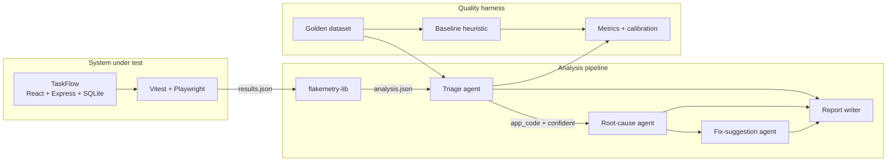

# Architecture

## Design constraint that shapes everything

**Nothing runs persistently.** Every component is a function invoked by a CLI script that exits.
State between runs is a file — carried by the CI cache, an artifact, or a commit to an orphan
branch. There is no server, no queue, no listener, no hosted database.

This is not a simplification for its own sake. A triage system that only ever runs once per CI
job has no reason to be a service, and making it one would add an availability problem, a
deployment problem, and a credentials problem to a system whose entire job takes eleven seconds.
The constraint also produces the strongest property of the project: a reviewer can clone it and
run the whole thing.

## Component map



## Data flow, stage by stage

### 1. Test execution → `results.json`

Playwright's JSON reporter and Vitest's JSON reporter emit different shapes. Both are normalised
into a single internal `TestRun` type at the boundary, defined in the `contracts/` workspace. The normaliser is the _only_ place that
knows about reporter-specific fields, so a Playwright major bump breaks one file, loudly, with a
Zod error — not silently, three stages downstream.

```ts
type TestRun = {
  runId: string
  commitSha: string
  branch: string
  startedAt: string // ISO 8601
  durationMs: number
  results: TestResult[]
}

type TestResult = {
  testId: string // stable: file path + full title
  title: string
  file: string
  status: 'passed' | 'failed' | 'timedOut' | 'skipped'
  attempts: number
  durationMs: number
  error?: { message: string; stack?: string; snippet?: string }
  annotations?: string[]
}
```

### 2. `results.json` + history → `analysis.json`

`flakemetry-lib` merges the current run against `.flakemetry/history.json` and emits per-test
signal:

```ts
type FlakySignal = {
  testId: string
  flakinessScore: number // 0..1, recency-weighted share of transitions that changed
  consecutiveFailures: number
  totalRuns: number // runs ever, not runs retained
  firstSeenAt: string
  lastPassedAt: string | null
  statusHistory: string // e.g. "PPPFPFPPF" — most recent last, capped
  isNew: boolean // first run in which this test exists
}
```

#### The score

A **transition** is a run with a run before it to differ from, and the score is the share of
transitions that changed the outcome, each weighing `0.5 ^ (age / halfLife)` with age counting back
from the newest. The half-life defaults to 10 runs — the question a report answers is whether a test
is unstable _now_, and a test that thrashed a month ago and has been solid since should not read as
flaky today.

Three consequences, and they are the reason it is defined this way rather than as a failure rate:

- `FFFFFFFF` scores **0**. Nothing changed, so nothing alternated. A test that fails every run is
  broken, not flaky, and scoring it high would put every genuine regression into the `intermittent`
  bucket — the one mistake the two-axis taxonomy exists to prevent. It falls out of the definition
  rather than needing a rule.
- `PFPFPFPF` scores **1**, at any length.
- As the half-life grows the weights flatten, and in the limit the score is exactly the plain
  alternation rate. That is deliberate: it is what the dataset fixtures were scored with before the
  real definition existed, so recency weighting was the only thing that moved when they were
  rescored.

Skipped runs are dropped before scoring — a skip produced no evidence, and reading it as "did not
fail" invents an alternation on both sides of it, so a quarantined test would score as the flakiest
in the suite. A run that was flaky _within itself_ counts as a transition even in first position: it
failed and passed without needing a neighbour, and that is the only alternation the status string
cannot express.

`isNew` is read from the history as it stood **before** the run, never derived from the merged
history — the cap evicts a test's earliest entries, and with a small enough cap every test in the
suite would read as new.

#### The history file

`.flakemetry/history.json` is the only artifact here that is written by a machine, read by a later
version of the same machine, and never looked at by anyone. It stores what the scoring reads and
nothing else — errors, stacks and snippets belong to the run that produced them:

```ts
type History = {
  schemaVersion: number
  tests: Record<
    string, // deriveTestId(file, title)
    {
      firstSeenAt: string
      totalRuns: number // runs ever recorded, not entries retained
      entries: {
        runId: string
        at: string // the run's start time
        status: 'passed' | 'failed' | 'timedOut' | 'skipped'
        flakyWithinRun: boolean
      }[] // oldest first
    }
  >
}
```

**The merge rule**, in full:

1. Every result in the run becomes one entry against its `testId`.
2. An entry already carrying this `runId` is **replaced**, not duplicated. GitHub keeps `run_id`
   stable across "re-run all jobs", so appending would double a test's apparent stability every
   time somebody retried a build.
3. Tests in the history and not in the run are untouched. Absence has too many innocent causes —
   sharding, a `--grep` filter, a suite that failed to start — and recording it as a status would
   inject invented alternations into the signal.
4. `firstSeenAt` only ever moves earlier, and `totalRuns` counts every run the test has been
   recorded in. Both are stored rather than derived from `entries`, because the cap evicts from the
   front: a test first seen in March would otherwise start reporting itself as new, and every test
   that has run more than the cap would report the cap for ever — telling a reader weighing a score
   that a year of history and a fortnight of it are equally evidenced.
5. Entries are ordered by run start time, not by arrival, so a job for an older commit finishing
   late cannot make its result the most recent one. `consecutiveFailures` reads the tail of that
   order.
6. The oldest entries beyond the cap are dropped. The cap defaults to 50 runs per test — several
   times the scoring half-life, so the cap does not shape the score, and small enough that the file
   is not what breaks the cache.

`flakyWithinRun` is retained per entry because it cannot be recovered from `status`. A test that
fails on attempt 1 and passes on attempt 2 is recorded green; store only the status and a test that
does that on _every_ run reads back as `PPPPPP` — scored as the most stable test in the suite when
it is the least.

Writes are atomic (write temp, rename) so an interrupted job cannot leave a truncated file. A
missing file is an empty history, not an error; a file that exists and cannot be understood **is**
an error, because treating it as empty would hide the one symptom that says something is writing
the file wrongly.

#### The command

```
npm run flakemetry:analyze [-- --report <path>… --history <path> --out <path> --write-history]
```

Defaults to reading both `results.json` and `results-unit.json` when they exist — a default that is
absent is a suite that did not run in this job, while a path somebody typed and got wrong is a
mistake worth stopping for. The two are analysed separately against the same history and their
results concatenated rather than merged into a single `TestRun` first, because a merged run would
need one value for `source` and there is no honest one.

**History is written only with `--write-history`.** ADR-0004 confines writes to `main`, and
read-only is the direction for a flag to be forgotten in: a default that persisted would have every
pull-request job contribute its own branch's failures to the history that judges the next one.

**It exits 0 when tests failed.** The command describes a run, and a run full of failures is the
case it exists for. A non-zero exit would stop the pipeline exactly where it should be producing its
most useful output, and CI already knows the suite went red from the suite.

When CI supplies no `GITHUB_RUN_ID`, the run's identity is a hash of the reports rather than
anything drawn from the clock or the process. `mergeRun` keys idempotency on `runId`, so a local id
that moved between invocations would append a second entry for every test and double the history —
the exact double-counting the id exists to prevent.

### 3. `analysis.json` → agent inputs

For each failing or newly-flaky test the orchestrator assembles a **context bundle**:

| Field                                        | Source         | Why the agent needs it                               |
| -------------------------------------------- | -------------- | ---------------------------------------------------- |
| Error message + stack                        | test report    | primary evidence                                     |
| Code snippet at failure                      | test report    | distinguishes assertion from infrastructure failure  |
| Flakiness score + status history             | flakemetry-lib | separates deterministic from intermittent            |
| `isNew`, `consecutiveFailures`               | flakemetry-lib | a brand-new always-failing test is a different story |
| Diff of files touched in this commit         | `simple-git`   | separates app regression from test drift             |
| Whether the diff touches the file under test | derived        | the single strongest heuristic signal                |
| Test source                                  | filesystem     | detects missing waits, shared state                  |

`agents/context.ts` assembles it, and three things about how are load-bearing.

**It is pure** — no filesystem, no git, no network; callers read paths and pass the contents in —
which is what makes it unit-testable without a repository and what makes the ablation study cheap:
removing a context field is removing an option, not rewiring a pipeline. Enforced by lint, and the
lint is itself tested by feeding it a violation.

**It splits the bundle by trust rather than by convenience.** Numbers this pipeline computed —
flakiness, streaks, retries, and whether the diff touched the code under test — are stated plainly,
because a contributor cannot forge them. Every string that came out of the repository goes through
`agents/sanitise.ts` and is fenced as data. The prompt says which half is which, so the model has
somewhere to stand when the prose and the numbers disagree.

**Whether the diff touches the code under test** is derived from the stack trace first — the
application frames the failure passed through — and from the `Board.spec.ts` → `Board.ts` naming
convention second. The convention is the fallback rather than the rule because it is a convention;
it earns its place by carrying the signal in the case the stack cannot, a locator timeout with no
application frame at all, which is exactly when the answer matters most. Path comparison is
suffix-on-a-segment-boundary: reporters emit absolute paths while diff headers are
repository-relative, so equality would make the strongest signal in the bundle silently always
false.

Per [ADR-0006](adr/0006-single-shot-agents-no-loop.md) there is no loop in which a model can go
and find what it was not given, so the ceiling on classifier accuracy is set here rather than in
the prompt.

### 4. Agents → `report.md`

Three single-shot LLM calls, described in [agent-design.md](agent-design.md). No loop, no
scratchpad, no tool use beyond the structured-output schema. The orchestrator handles fan-out,
concurrency limit, token budget, retries, and partial failure.

### 5. `report.md` → PR comment

A workflow step reads the file and calls `actions/github-script`. Comments are **upserted**: the
step looks for a previous comment carrying a hidden marker (`<!-- sentra:report -->`) and edits
it in place instead of appending a new one on every push.

## State between runs

| What                   | Where                                                             | Why                                                    |
| ---------------------- | ----------------------------------------------------------------- | ------------------------------------------------------ |
| Test-run history       | `actions/cache` keyed on branch, restore-key falls back to `main` | Survives across runs; cache is keyed, unlike artifacts |
| Golden dataset         | Committed to the repo                                             | It is source, not state                                |
| Recorded LLM cassettes | Committed under `agents/replay/cassettes/`                        | Makes the demo reproducible                            |
| Eval baseline scores   | Committed to `eval/report.md`                                     | Regressions become visible in the diff                 |
| OTel spans             | Job artifact                                                      | Diagnostic only, disposable                            |

**Concurrency hazard:** two PR runs finishing at once both read the same history and both write.
The loser's update is lost. Mitigations, in order of preference: (a) only the `main` branch job
writes history, PR jobs read-only; (b) merge-on-write rather than overwrite; (c) accept it and
document it. Option (a) is the plan — see ADR-0004.

## Failure modes and degradation

The pipeline never fails the build because of its own problems. It degrades:

| Failure                | Behaviour                                                                  |
| ---------------------- | -------------------------------------------------------------------------- |
| No API key (fork PR)   | Baseline heuristic only, comment states it                                 |
| API error / rate limit | Retry with backoff; on exhaustion, that test is reported `unclassified`    |
| Token budget exceeded  | Stop fanning out, report what was classified, note the truncation          |
| No history file        | Treat every test as `isNew`, reduce confidence in intermittency judgements |
| Malformed test report  | Zod error, pipeline step fails loudly — this one _should_ be noisy         |
| Zero failures          | Skip the agent stage entirely, post nothing                                |

## What is deliberately not here

- **No agent loop.** Classification is a single decision with a fixed input. An agentic loop
  would add latency, cost, and non-determinism for no measured gain. If ablation shows a
  multi-step agent beats a single call, that becomes an ADR and a milestone — not a default.
- **No vector store.** History is a few hundred rows of structured data. It is a JSON file.
- **No fine-tuning.** The eval harness exists partly to prove whether prompting is sufficient.
- **No cross-repo service.** Generalising this to arbitrary repositories is a different project
  with a different set of problems (auth, multi-tenancy, data retention).
