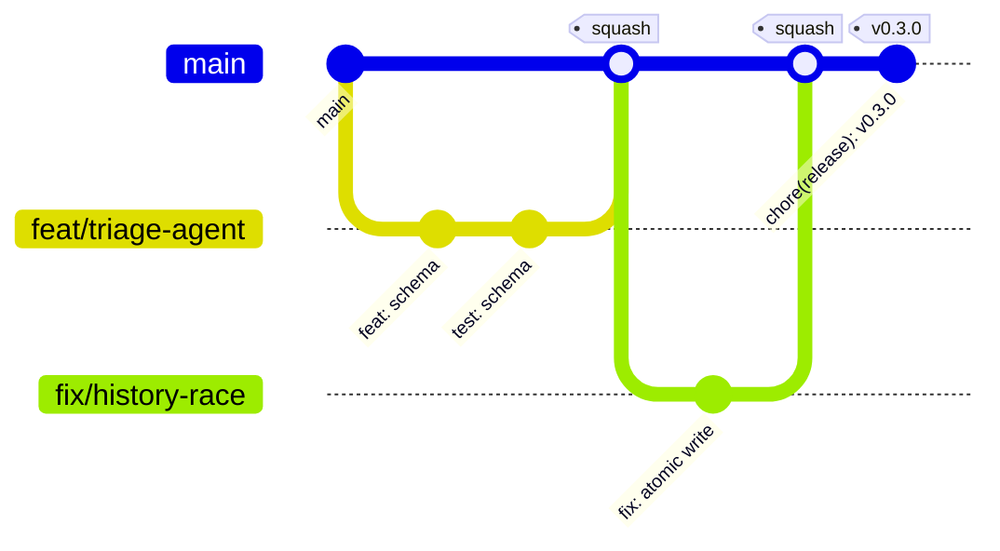

# Branching, commits & release strategy

## Model: trunk-based with short-lived branches

`main` is always releasable. Everything else is a short-lived branch that exists for hours or
days, never weeks. There is no `develop`, no long-running release branch, no `staging`. For a
single-maintainer project with a CI pipeline that takes minutes, GitFlow's ceremony buys nothing.



## Branch naming

```
<type>/<issue-number>-<short-kebab-summary>
```

Examples:

```
feat/42-triage-agent-schema
fix/57-history-atomic-write
docs/12-eval-methodology
chore/03-eslint-flat-config
exp/61-multistep-agent-ablation
```

| Prefix      | Use for                                        |
| ----------- | ---------------------------------------------- |
| `feat/`     | New capability                                 |
| `fix/`      | Bug fix                                        |
| `docs/`     | Documentation only                             |
| `test/`     | Tests only                                     |
| `chore/`    | Tooling, deps, CI config                       |
| `refactor/` | Behaviour-preserving change                    |
| `perf/`     | Performance                                    |
| `exp/`      | Experiments and ablations that may never merge |

Including the issue number makes the branch self-linking in the GitHub UI and makes stale
branches traceable to closed work.

### Protected and special branches

| Branch               | Rule                                                                              |
| -------------------- | --------------------------------------------------------------------------------- |
| `main`               | Protected. No direct pushes, no force-push, no deletion. PR + green CI required.  |
| `flakemetry-history` | Orphan branch, machine-written only. Excluded from CI. Humans do not commit here. |
| `gh-pages`           | Reserved for a future published eval dashboard.                                   |

## Commit convention

[Conventional Commits](https://www.conventionalcommits.org/), enforced by `commitlint` via a
Husky `commit-msg` hook.

```
<type>(<scope>)<!>: <subject>

[body]

[footer]
```

**Types:** `feat`, `fix`, `docs`, `test`, `chore`, `refactor`, `perf`, `build`, `ci`, `revert`.

**Scopes:** `app`, `client`, `server`, `tests`, `e2e`, `flakemetry`, `agents`, `triage`,
`root-cause`, `fix-suggestion`, `eval`, `dataset`, `prompts`, `ci`, `docs`, `otel`, `deps`,
`deps-dev`, `release`.

The list is enforced by `commitlint.config.js` and mirrored by the `PR title convention` job in
`.github/workflows/ci.yml`. All three have to agree: a commit that passes the local hook and then
fails the CI check is worse than either gate on its own. `deps` and `deps-dev` exist because
Dependabot is configured to emit them.

```
feat(triage): classify on owner and determinism axes

Replaces the flat four-value enum with two orthogonal axes. The flat list
made race conditions unlabellable — a product race is both a real bug and
intermittent, so ground truth was not reproducible between labellers.

Closes #42
```

**Breaking changes** use `!` after the scope and a `BREAKING CHANGE:` footer. Schema changes to
`analysis.json` or the fixture format are breaking; both are consumed by committed data.

**Prompt changes are never `chore`.** A prompt edit changes behaviour and must be `feat` or `fix`
with an eval delta in the PR body. Prompts are code.

## Pull requests

**Requirements before merge**

1. Green CI: lint, typecheck, unit, e2e, contract.
2. Eval gate green when the PR touches `agents/`, `eval/`, or `prompts/`.
3. PR description follows the template, links its issue, and states how the change was verified.
4. Prompt/agent changes include the before/after eval table in the description.
5. No unresolved review threads.

**Size.** Target under ~400 changed lines. Larger PRs get split unless the change is genuinely
atomic (a schema migration, a generated lockfile).

**Merge strategy: squash only.** Merge commits and rebase-merge are disabled. One issue → one
branch → one commit on `main`. The branch's messy history stays in the PR where it is useful and
out of `main` where it is not. The squash subject must itself be a valid Conventional Commit,
because release notes are generated from `main`'s history.

**Draft PRs** are opened early and deliberately — CI runs, the eval delta becomes visible while
the work is still cheap to change.

### Who can merge

Write access, and nothing else. GitHub enforces it; there is no repository convention here that
could quietly drift.

|                                    |                                                                                                            |
| ---------------------------------- | ---------------------------------------------------------------------------------------------------------- |
| Accounts with write access         | one — [@AKogut](https://github.com/AKogut)                                                                 |
| Direct pushes to `main`            | rejected; a pull request is required                                                                       |
| Required status checks             | `Repository hygiene`, `PR title convention`, `Static analysis`, `Unit & contract tests`, `Evaluation gate` |
| Branch must be current with `main` | yes                                                                                                        |
| Merge strategy                     | squash only                                                                                                |

Approval from anyone without write access does not make a pull request mergeable. This is worth
stating explicitly because the reverse — a repository where the rule is a norm rather than a
setting — looks identical from the outside.

The still-skipping jobs (`E2E tests`, `Flakiness analysis & triage`) are deliberately **not**
required yet. A required check that never reports leaves every pull request waiting for a status
that will not arrive. Each is added to the required set by the milestone that makes it run —
`Evaluation gate` joined it in #27, the change that made it run at all.

### Outside pull requests

The repository is public and forking cannot be disabled for public repositories, so anyone can
open a pull request. That is fine, and [ADR-0007](adr/0007-no-github-app-no-pull-request-target.md)
treats it as a supported path rather than an accident.

Two things happen to such a pull request, and they answer different questions:

**Whether CI runs at all.** Workflows on a fork pull request require explicit maintainer approval,
every time — the Actions approval policy is `all_external_contributors`, not GitHub's default of
`first_time_contributors`. Under the default, a second pull request from the same account runs
without approval, including one that edits the workflow files themselves. Approving a run is a
deliberate act of reading the diff first.

**What it can reach once running.** Nothing secret. Fork pull requests receive no secrets, so the
agent stage cannot run and the pipeline degrades to the baseline heuristic, saying so plainly in
its comment. `pull_request_target`, the usual workaround, is not used anywhere in this repository —
the reasoning is in ADR-0007.

## Review

Single maintainer, so `CODEOWNERS` self-assignment is a routing mechanism rather than a gate.
The self-review checklist in the PR template is the real control.

Reviews focus, in order, on: does the eval move; is the guardrail still enforced; is the change
covered by a test; is it the smallest change that works.

## Versioning & releases

[Semantic Versioning](https://semver.org/) on tags: `v0.3.0`, `v1.0.0`.

Pre-1.0, the public surface is the CLI script contract and the `analysis.json` / fixture schemas.
`v1.0.0` ships when the Definition of Done in the README is met end to end.

Releases are cut from `main` by tagging. `CHANGELOG.md` is generated from Conventional Commits by
`npm run changelog`.

**When it is regenerated: at every milestone close, and at every release.** Deliberately not on
every merge — that would make every open pull request conflict on `CHANGELOG.md`, and the cure
would be worse than a file a few commits behind. Deliberately not never, either: "not per merge"
without a stated alternative decays into "not at all", which is exactly what happened between M0
and M2 (#117).

`npm run changelog:check` fails when the committed file is behind `main`. It is run by hand at
those two moments rather than in per-PR CI, for the same conflict reason. GitHub Releases carry the changelog section plus the current
`eval/report.md` headline numbers — **the accuracy of the classifier is part of the release
notes.**

## Issue workflow

```
Backlog → Ready → In progress → In review → Done
```

- Every PR closes exactly one issue via `Closes #N`.
- Issues carry one `type:` label, one `area:` label, one `priority:` label, and a milestone.
- `blocked` issues state what they are blocked on in the body.
- Experiments (`type: experiment`) may close as "not adopted" with the finding recorded in the
  issue and, if it changed a decision, an ADR.

## Architecture decision records

Non-obvious or reversible-at-cost decisions are recorded in `docs/adr/` using the
[MADR](https://adr.github.io/madr/) format. An ADR is required when a change alters the agent
architecture, the classification schema, the persistence approach, or a guardrail. ADRs are never
edited after acceptance — they are superseded by a new ADR that links back.
