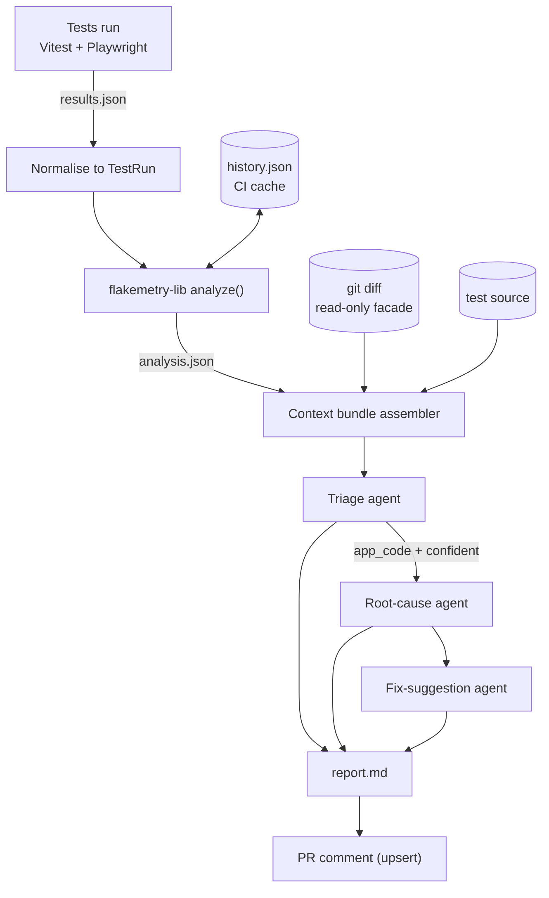

# Architecture Overview

> Narrative orientation. The normative specification — types, field definitions, failure-mode table —
> is [`docs/architecture.md`](https://github.com/AKogut/ai-flaky-test-triage/blob/main/docs/architecture.md).

## The constraint that shapes everything

Nothing runs persistently. Every component is a function invoked by a CLI script that exits. State
between runs is a file carried by the CI cache.

That is not minimalism for its own sake. The work is triggered exactly once per CI run and takes
seconds. Making it a service would add an availability problem, a deployment problem, and a
credentials problem to a workload with no continuous demand — and it would destroy the property
that matters most: someone can clone the repository and run the whole thing.

Full argument: [ADR-0001](https://github.com/AKogut/ai-flaky-test-triage/blob/main/docs/adr/0001-single-repo-no-persistent-services.md).

## The pipeline, end to end

Six stages. Each is a pure-ish function over files, which is why each is testable without a
network, a browser, or a git repository.

## Stage by stage, and why each exists

**Normalisation.** Playwright and Vitest emit different shapes; both become a single `TestRun`
type at the boundary. Everything downstream is reporter-agnostic. The payoff is that a Playwright
major version bump breaks one file loudly instead of silently corrupting the flakiness signal three
stages later.

**Flakiness analysis.** Merges the current run against the stored history and produces per-test
signal: an alternation-weighted flakiness score, a failure streak, whether the test is new. The
scoring measures _alternation_, not failure rate — a test that fails 100% of the time is not flaky,
it is broken, and conflating those would put every genuine regression in the `intermittent` bucket.

**Context assembly.** The most consequential and least glamorous stage. It turns one entry in
`analysis.json` into the evidence bundle the model sees: error, stack, snippet, flakiness history,
diff, whether the diff touches the file under test, and the test's own source.

Because the agents are single-shot with no tools, the ceiling on classification accuracy is set
here, not in the prompt. Improving accuracy means improving what the model can see — which is
ordinary engineering rather than prompt tinkering, and is arguably the point.

**Triage.** One model call, forced output schema, two-axis classification. Details in
[Agent Design](Agent-Design).

**Root cause and fix suggestion.** Run only for `app_code` classifications above a confidence
threshold read off the calibration curve. Both produce text. Neither can write anything.

**Report and comment.** One markdown document, posted once and edited in place on subsequent
pushes. It states the classifier's own measured accuracy inline, so nobody reads it as ground
truth.

## State between runs

The only genuinely stateful thing is the test history, and it lives in the GitHub Actions cache
with a fallback chain from branch history to `main` history.

Two design points worth knowing:

- **Only `main` writes.** Pull-request runs read history but never update it. This eliminates the
  lost-update race between concurrent runs entirely rather than mitigating it.
- **Cache is not durable.** Eviction after seven days idle is normal. A missing history is an
  expected operating condition, not an error: every test looks new, the `determinism` axis degrades
  to within-run retry evidence, and the report says so rather than quietly getting worse.

Rationale and rejected alternatives: [ADR-0004](https://github.com/AKogut/ai-flaky-test-triage/blob/main/docs/adr/0004-history-persistence-via-ci-cache.md).

## Degradation, not failure

The pipeline never fails a build because of its own problems. A red X caused by the triage tool
rather than by the tests would train everyone to ignore the check, which is the one outcome that
makes the whole project useless.

So every failure mode degrades and announces itself: no API key on a fork PR → baseline heuristic
only; API error → that one test is `unclassified`; budget exhausted → stop dispatching and say how
many were dropped; no history → reduced confidence, stated.

The one exception is a malformed test report, which fails loudly. That one _should_ be noisy — it
means a contract broke.

## What is deliberately absent

No agent loop ([ADR-0006](https://github.com/AKogut/ai-flaky-test-triage/blob/main/docs/adr/0006-single-shot-agents-no-loop.md)),
no vector store, no fine-tuning, no cross-repository service. Each of those was considered and
rejected for a stated reason rather than overlooked, and each rejection is written as a testable
claim — the ablation study includes a multi-step agent variant precisely so that "no loop" remains
an empirical position rather than a preference.

## Further reading

- [`docs/architecture.md`](https://github.com/AKogut/ai-flaky-test-triage/blob/main/docs/architecture.md) — types, field tables, failure modes
- [Agent Design](Agent-Design) — prompts, schemas, orchestration
- [Decision Records](Decision-Records) — the seven ADRs
